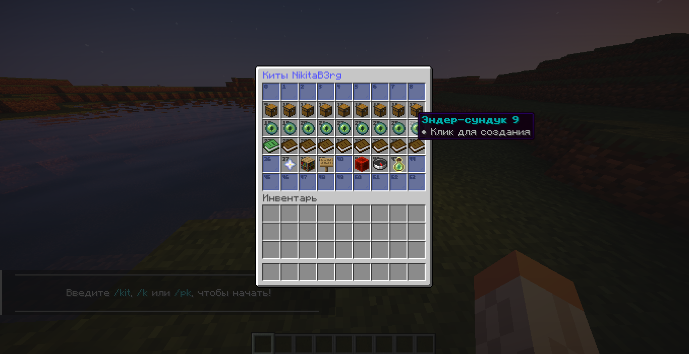

# PerPlayerKit

Присоединяйтесь к Discord для получения дополнительной информации и поддержки: [Discord](https://discord.gg/5djuBSKWuV)

## 🚀 Быстрый старт

Новичок в PerPlayerKit? Ознакомьтесь с нашим [Простым руководством по настройке](./SIMPLE_SETUP_GUIDE.md) с пошаговым объяснением, которое поможет вам начать работу всего за несколько минут!

## Лицензия: AGPLv3

PerPlayerKit — это программное обеспечение с открытым исходным кодом, лицензированное в соответствии с условиями [GNU Affero General Public License v3.0](./LICENSE). Прочитайте и поймите лицензию перед использованием этого программного обеспечения. [Часто задаваемые вопросы о лицензиях GNU](https://www.gnu.org/licenses/gpl-faq.html#AGPLv3InteractingRemotely).

## Вклад в развитие PerPlayerKit

Если вы хотите внести свой вклад в проект, вы можете сделать это, создав ответвление (fork) репозитория и отправив запрос на слияние (pull request). Мы предпочитаем, чтобы улучшения и вклады объединялись с основной ветвью (main branch), а не распространялись по множеству ответвлений.

## О плагине

PerPlayerKit — это плагин для [PaperMC](https://papermc.io/), который позволяет игрокам создавать свои собственные уникальные киты для PvP. Администраторы создают набор предметов в "Виртуальной комнате китов", из которых игроки выбирают свои предметы. Затем они могут создать до 9 китов, которые можно делиться, изменять и просматривать модераторам. В плагине предусмотрен графический интерфейс (GUI) для простого использования. Кроме того, можно использовать команды для быстрой загрузки китов и функций модератора. Также включены защиты от злоупотребления предметами, ограничивающие NBT-данные и зачарования до того, что доступно в ванильном Minecraft, и разрешающие только те предметы, которые можно найти в "виртуальной комнате китов". Игроки также могут использовать плагин для создания китов эндер-сундуков, которые будут загружаться в их эндер-сундук, когда они выбирают кит эндер-сундука.

## Зависимости

PerPlayerKit использует библиотеку GUI для Minecraft под названием canvas, которую можно найти [здесь](https://github.com/IPVP-MC/canvas). PerPlayerKit поддерживает версии 1.19 и выше.

## Установка

PerPlayerKit имеет минимальную конфигурацию, требуя только выбор типа базы данных. PerPlayerKit поддерживает как MySQL/совместимые с MySQL (MariaDB) базы данных, так и SQLite базы данных. Если вы не знаете, что делать, или у вас нет доступа к базе данных, используйте `sqlite` в качестве типа базы данных.

Чтобы использовать плагин, запустите сервер с плагином в папке "plugins", затем остановите сервер и отредактируйте файл config.yml в папке "plugins/PerPlayerKits".

Доступно больше параметров конфигурации, смотрите [документацию по конфигурации](./CONFIG.md).

## Команды и разрешения

Для получения подробной информации о командах и разрешениях, пожалуйста, обратитесь к [документации по командам](./COMMANDS.md).

## Внешнее API

PerPlayerKit имеет простое API, которое позволяет разработчикам взаимодействовать с плагином. API **НЕ**стабильно и может измениться в будущем. Пожалуйста, обратитесь к [документации API](./API.md) для получения дополнительной информации.

Переводом на русский занимался [NikitaBerg](https://github.com/nikitaberg28). Заходите также на мой [сайт](https://nikitaberg.ru), чтобы узнать обо мне больше.